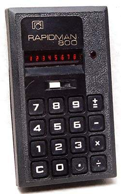

+++
title = "Four Function Calculator"
+++

# Four Function Calculator

This is a supplemental task description for HW02, where we practice basic
in-browser JS, HTML, and CSS.

Here's an old 4-function calculator:

Relevent features:

 * A display showing a single number.
 * A grid of 4 by 4 buttons including:
   - Numbers 0 - 9
   - Four arithmetic operators (with + also acting as =).
   - C means "clear"
   - Decimal point

The calculator can be modeled as a state machine. Pressing any button does
something meaningful at any time, but number buttons do two different things
depending on the state:

 * Sometimes they add a digit to the current number.
 * Sometimes they start a new number.

Pressing a button should call a JavaScript function that updates the internal
state and the display as appropriate.

